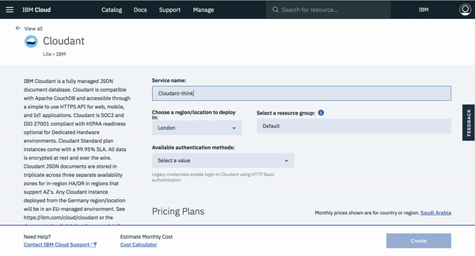
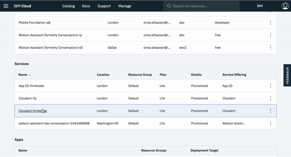
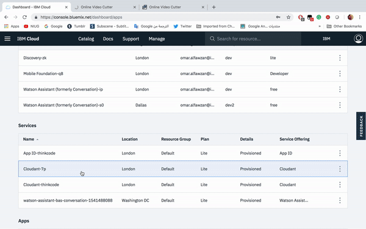
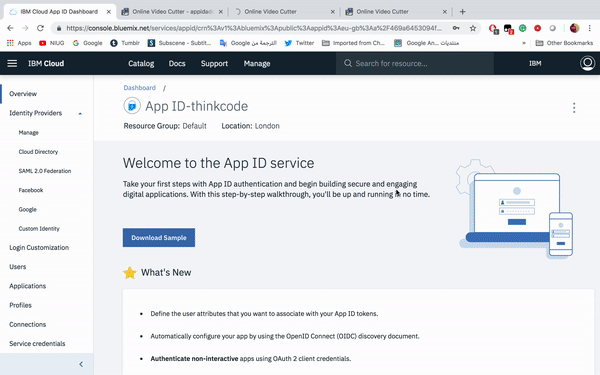
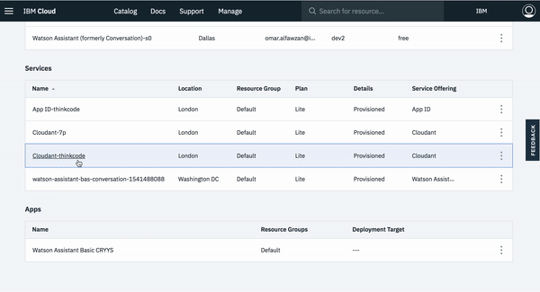
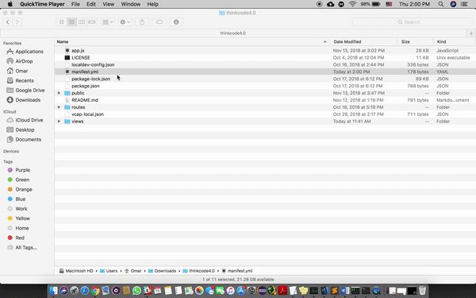
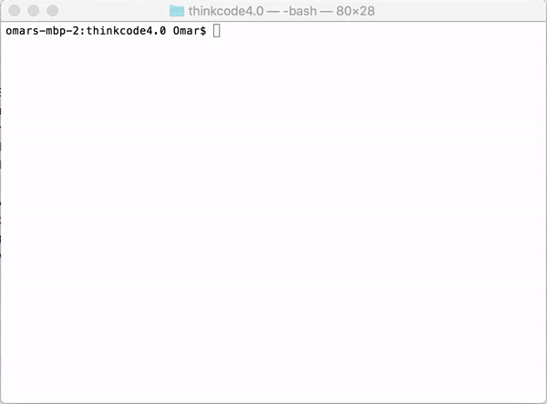
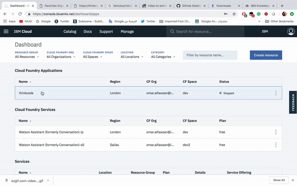

# Think-Code-Deliver

## Introduction
In this tutorial we will make our own Cloud Web App using IBM Cloud and its services. Starting from securing user information by using App ID service, to using IBM Cloud Cloudant database. In the end we will deploy our app both locally and to the cloud.

## Prerequisites
* [IBM Cloud](https://ibm.biz/thinkcodedeliver "IBM Cloud")
* [IBM Cloud CLI](https://ibm.biz/ibmcloudcli "IBM Cloud CLI")
* [Node.js npm](https://nodejs.org/en "Node.js")

## Architecture

1. User opens the app 
2. User sign in 
3. App ID service checks and validates the user
4. After authenticating the user can access the app
5. Retrieve data and upload it to Cloudant 

## Lab Steps
### 1. Clone or Download the github file

### 2. Create [Cloudant](https://console.bluemix.net/catalog/services/cloudant "Cloudant service") service

### 3. Create [App ID](https://console.bluemix.net/catalog/services/appid "App ID service") service

### 4. To run locally
   #### 4.1. Copy credentials of your Cloudant service
   
   
   #### 4.2. Copy credentials of your App Id service
   
   #### 4.3. Open App ID and add your own URL after going to **Manage > Authentication Settings**
   
   #### 4.4. Run the App
   First open your terminal/command prompt then write `cd [app path]` to get inside the directory of your project. After, write `npm install`, then finally write `npm start`. You can access your application through `https://localhost:3011`
### 5. To run in IBM Cloud
   #### 5.1. Open manifest and add the name
   
   #### 5.2. Login to IBM Cloud via terminal then choose the right APi
   Open your terminal/command prompt then write `ibmcloud login api`
   #### 5.3. Push the App to IBM Cloud
   First write `ibmcloud target --cf`, then write `ibmcloud app push [name of your app] --no-start`
   
   #### 5.4. From Cloud Foundray create connection App ID and Cloudant, then stop the app
   
   
   #### 5.5. Copy your URL and add it to App ID
   
   #### 5.6. Now you're app is deployed and you can start using it
   

## Conclusion 
Congratulations! You now have your own cloud deployed storage web app. You can customize the app to your liking by changing the Github project's code, such as the HTML or CSS file.

  

